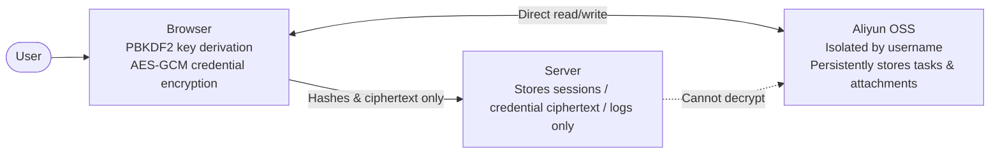
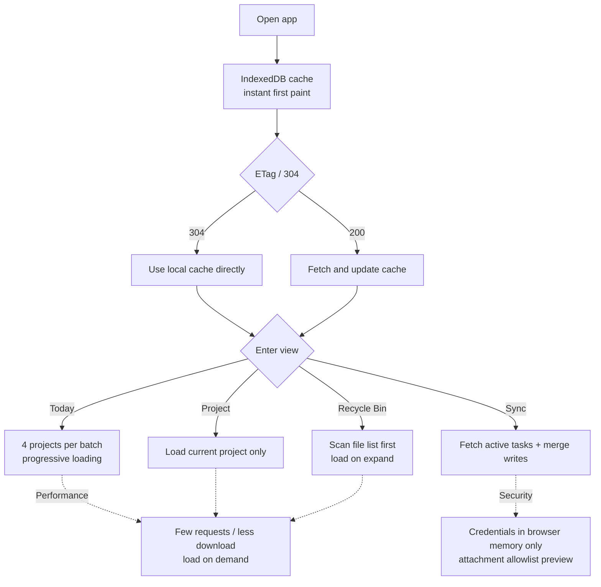

# MeiDay

A privacy-focused, high-security, lightweight task & diary management system.


Demo video:

<video controls="controls" src="https://b3logfile.com/file/2026/08/123-JKKiRDa.mp4"></video>

## Features

### Frontend/Backend Separation & Data Isolation

Task data never touches the server. Even if the backend is compromised, attackers only see ciphertext and hashes. OSS objects are isolated by `users/<username>/`, and deleted items go to the Recycle Bin first instead of being purged automatically.




### Real-time Multi-device Sync

The web, app, and SiYuan plugin all read from the same OSS data online — there is no local data, so sync happens in seconds.

### Private Diary System

Diary data is stored encrypted in OSS. The server stores no data and no account passwords. Encrypted import/export backups are supported, and diary entries can be deleted to reduce OSS storage costs.


### Dynamic Loading

Prioritizes the local cache and 304 conditional requests. The Today page loads in batches concurrently, the Recycle Bin loads on demand, and conflicts are merged on refresh.




### WeChat / Email Reminders

Task reminders support background notifications via WeChat email. Events such as hacker logins, credential viewing, config changes, and password brute-force attempts are all recorded in the logs and notified to the user via WeChat/email so they can take action immediately.


### Bulk Task Import

Supports bulk importing of tasks.


### Recurring / Reminder Tasks

Supports recurring WeChat/email reminders, such as a daily clock-in reminder for work.


### Project / Task Recycle Bin

All tasks are sent to the Recycle Bin, and its projects and tasks are loaded dynamically when viewed.


### Detailed Operation Logs

Various user actions are recorded, such as displaying credentials, login logs, and detailed operation logs.


### Data Migration

1. All system data is stored in OSS and can be migrated as a whole package.
2. You can also migrate by category — both the private diary system and the Recycle Bin support import/export to reduce OSS consumption.


## Usage Guide

### Configure Aliyun OSS Bucket

#### Activate OSS


Hover over "Products", find and click **Object Storage OSS** to open the OSS product page. On the OSS product page, click **Activate Now**.


Click to purchase, then pay directly (it's free).


Create a bucket by following the instructions below and enter it. Be sure to note down the bucket name and Endpoint. We now have:

```python
OSS Bucket: congsec2
OSS Endpoint: oss-cn-beijing.aliyuncs.com
```


Click **AccessKey** in the avatar area, then select "Use RAM User AccessKey".


Click **Users**, create a user, and complete the SMS verification.


Copy out the AccessKey ID and AccessKey Secret. We now have:

```python
AccessKey ID: LTAI5t7UAgZjp3Yr7W19TvDN
AccessKey Secret: 1tVfbvxGYDGrP9iPjkvRqiGZJiJyCo
```


Configure OSS permissions for the user.


Go back to the OSS bucket page and grant the user permissions on the bucket.


Configure CORS for the bucket. Fill in the following three fields: `https://task.congsec.cn,https://localhost`, `*`, and `Etag`. Also be sure to check the request methods (step 4 in the image).


To summarize, we now have the following configuration:

```python
AccessKey ID: LTAI5t7UAgZjp3Yr7W19TvDN
AccessKey Secret: 1tVfbvxGYDGrP9iPjkvRqiGZJiJyCo
Bucket: congsec2
Endpoint: oss-cn-beijing
```

### Configure WeChat / Email Notifications

Open your QQ mailbox (creating a new account is recommended to avoid other email distractions) and go to **Settings**.


Click **Account & Security**.


Find the SMTP service, enable it, and generate an authorization code. You will get **SMTP Auth Code: xxxxx**.


Next, set up WeChat reminders — just search for "email" in WeChat settings and bind it (PS: if you find the reminders too repetitive, you can log out of the email and use WeChat reminders only).


The result is shown below:


### Register an EasyTask Account

Register your account here. You will be signed in automatically once registration completes.


Enter the credentials you obtained above in order.


Then click **Encrypt & Save**. If there are no errors, it means success!!!


## Self-hosting Guide

### Prerequisites

- Node.js 20+
- Python 3.10+
- Aliyun OSS account and AccessKey
- QQ mailbox or another SMTP service

### Backend

**Windows:**

```bash
cd backend
# Create virtual environment
python -m venv .venv
# Activate virtual environment
.venv\Scripts\activate
# Install dependencies
pip install -r requirements.txt
.venv\Scripts\python -m uvicorn app.main:app --host 0.0.0.0 --port 8000 --no-proxy-headers
```

**Linux:**

```bash
cd backend
# Create virtual environment
python3 -m venv .venv
# Activate virtual environment
source .venv/bin/activate
# Install dependencies
pip install -r requirements.txt
# Run in background
nohup .venv/bin/python3 -m uvicorn app.main:app --host 0.0.0.0 --port 8000 --no-proxy-headers > backend.log 2>&1 &
```

### Frontend

```bash
cd frontend

# Install dependencies
npm install
# Start the frontend (for the web build, use `npm run build:web`)
npm run dev
```

### CDN Setup Guide

#### Bind the CDN to the Bucket

For bucket creation, please refer to the tutorial above (remember to set the bucket to **public**, set CORS to your access domain, and keep **all other CORS fields consistent with the above**).


After creating the bucket, create a CDN domain and bind it to the bucket. Here we use "test" as an example.


Bind the bucket, click next, and verify the domain ownership.


#### Build the Frontend Artifacts

In the `frontend` folder, create a new file `vi .env.web` and fill it in as follows:

```bash
VITE_API_BASE_URL=
# Fill in your own frontend CDN-accelerated OSS below
VITE_CDN_BASE=https://static.congsec.cn
```

Then build the frontend artifacts with the `npm run build:web` command.


Upload the `assets` folder and `logo.png` to the bucket.


#### Verify

Run `cat frontend/index.html` — if the CDN domain appears, the build was successful.


Visit the corresponding JS file; if it loads successfully, the upload acceleration is working. You can then visit your site to try it out.

If the page returns blank, it may be a CORS issue or a CDN caching issue. Try refreshing the CDN cache and waiting a few minutes before visiting again.

### App Build Guide

In the `frontend` folder, create a `.env.production` file and fill it in as follows:

```bash
VITE_CDN_BASE=
VITE_API_BASE_URL=https://task.congsec.cn
```

Then simply run: `npm install` and `npm run apk:debug`.

### SiYuan Plugin Build Guide

Clone the project at [https://github.com/CongSec/MeiDay](https://github.com/CongSec/MeiDay), then in the `frontend` folder run `npm install` and `npm run build:plugin`.

Clone the project at [https://github.com/CongSec/meiday-siyuan-plugin](https://github.com/CongSec/meiday-siyuan-plugin).


Then build and copy the following contents into the corresponding files:

```powershell
# 1. Copy the first step's artifacts into the shell
Copy-Item ".\frontend\dist-plugin\index.html" `
          ".\meiday-siyuan-plugin\src\assets\app.html" -Force

# 2. Build the shell (plugin folder)
cd .\meiday-siyuan-plugin
npm install
npm run build

# 3. Copy into the SiYuan notes plugin folder
Copy-Item ".\meiday-siyuan-plugin\dist\*" `
          "D:\desktop\congsectest\data\plugins\meiday-siyuan-plugin\" -Recurse -Force

# 4. Quit SiYuan completely and reopen ← must restart; SiYuan does not hot-reload
```

## FAQ

**Q: Is HTTPS required?**

A: Yes. The app relies on the WebCrypto API (`crypto.subtle`), which is only available in secure contexts (HTTPS or localhost).

**Q: Does the server store my task data?**

A: No. All tasks, projects, and attachments are stored in your own Aliyun OSS and are returned directly to the browser without passing through the server. The server only stores login sessions and the encrypted OSS credentials.

**Q: What if I forget my password?**

A: Passwords cannot be recovered. However, you can export your OSS data, create a new account, and re-import it.

**Q: How do I back up my data?**

A: Simply enable automatic backups in your Aliyun OSS bucket.
